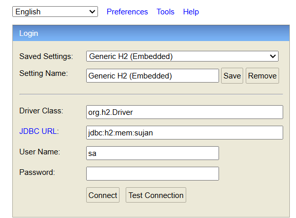
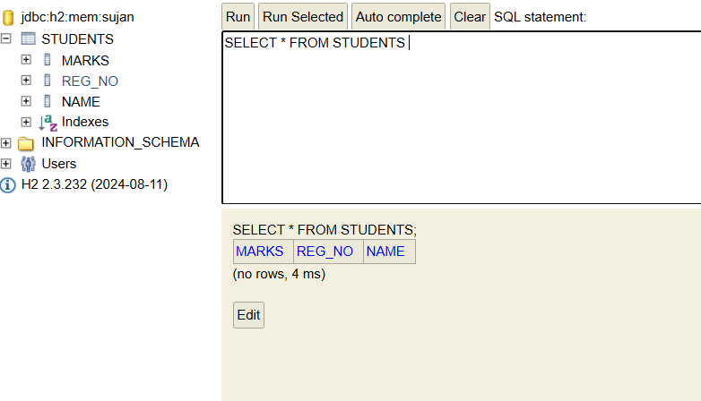
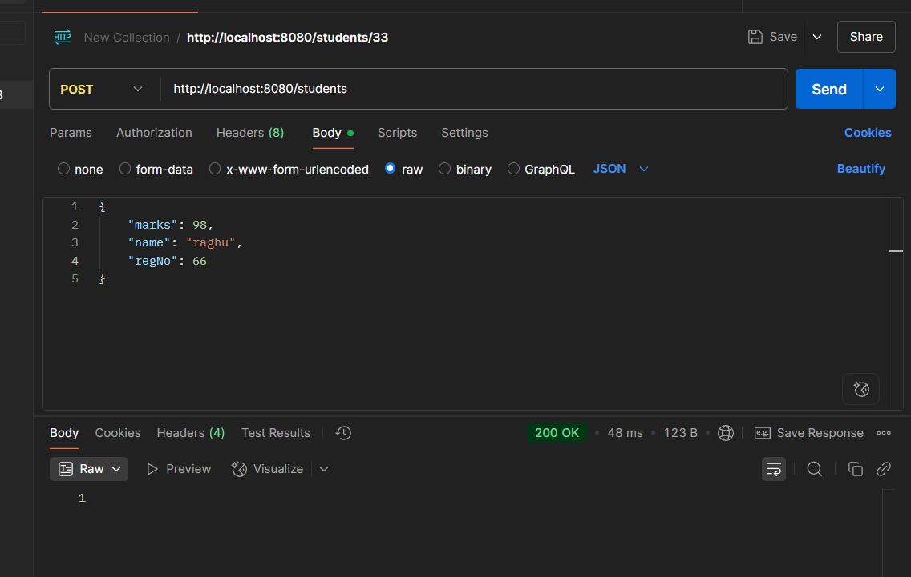
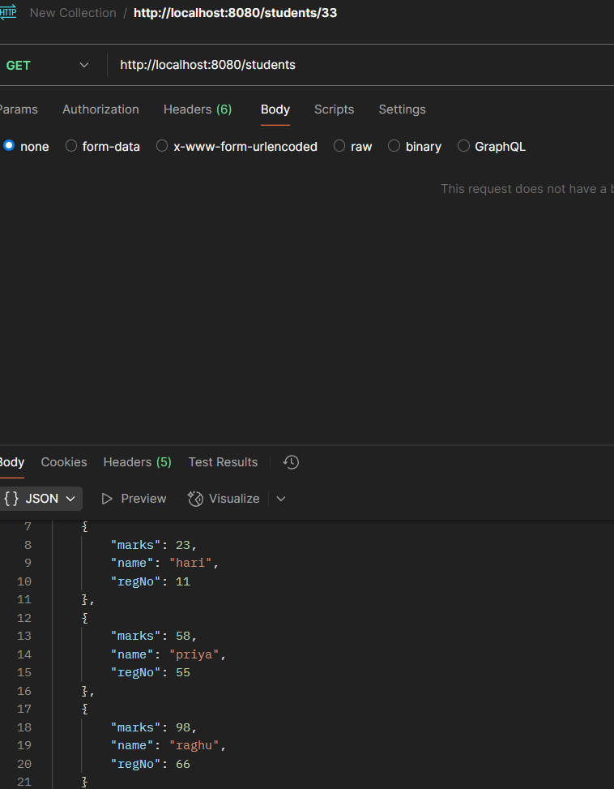
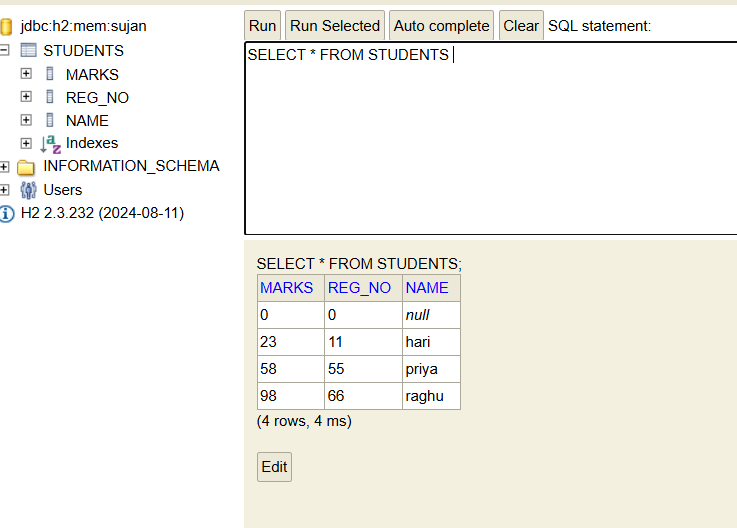

# Student Management API

A simple **CRUD-based RESTful API** for managing student records, built using **Spring Boot**, **Spring Data JPA**, **Spring JDBC**, and **Hibernate**. Data is stored and managed in an **H2 in-memory database** for easy testing and development.

## Features

- Create, Read, Update, and Delete (CRUD) operations on student entities
- Built using a layered architecture: Controller, Service, Repository
- Spring Data JPA for repository abstraction
- Hibernate ORM for database interaction
- Spring JDBC for additional data access flexibility
- Embedded H2 database with web console for visualization

## Technologies Used

- Java
- Spring Boot
- Spring Data JPA
- Spring JDBC
- Hibernate
- H2 Database

## Getting Started

### Prerequisites

- Java 17 or above
- Maven

### 1. How to Run

1. **Clone the repository:**

   ```bash
   git clone https://github.com/sujan-vucha/student-management-api.git
   cd student-management-api
2. **Build and run the application:**

   ```bash
   mvn spring-boot:run

  

3. **Access the application:**
- Base URL: http://localhost:8080
- H2 Console: http://localhost:8080/h2-console
- JDBC URL: jdbc:h2:mem:testdb
- Username: sa
- Password: (leave blank)
  


#### 2. Adding from Postman


#### 2. Fetching Data from Postman


#### 2. Table data on H2



 
